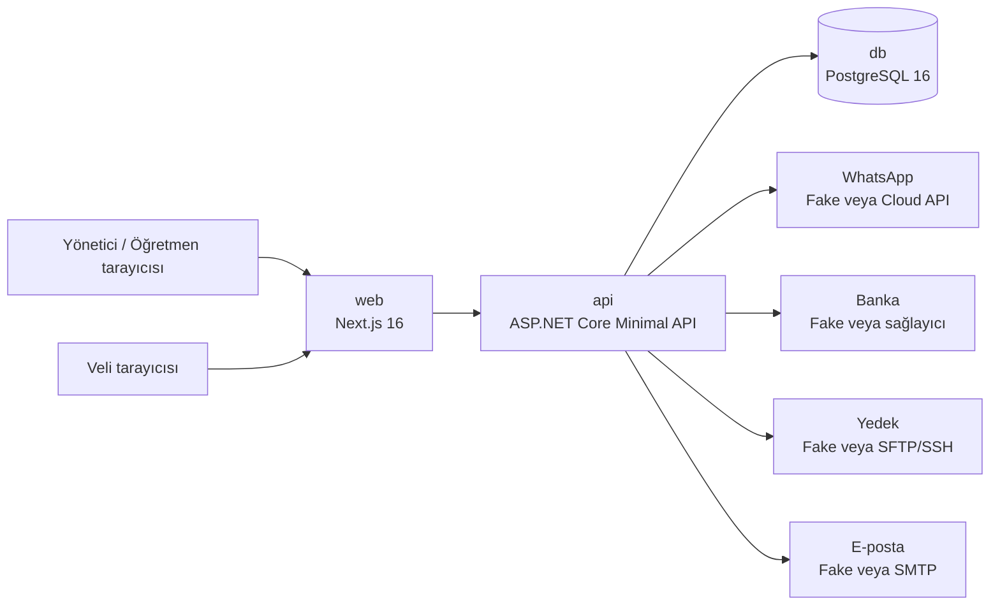

# Abdera — Müzik Okulu Yönetim Sistemi

Küçük bir müzik okulunun öğrenci, öğretmen, ders, aidat, gelişim ve veli iletişimini tek yerde topladığı web uygulaması.

**Kapsam:** ders takvimi ve öğretmen programları · veli RSVP'si · devamsızlık ve telafi dersleri · aidat/tahsilat takibi · birim fiyat yönetimi · ders notları ve öğrenci gelişimi · WhatsApp üzerinden otomatik ve etkileşimli bilgilendirme.

**Kullanıcılar ve arayüzleri**

| Kim | Nereden |
|---|---|
| Yönetici | Web uygulaması (masaüstü + mobil) |
| Öğretmen | Mobil öncelikli web / PWA |
| Veli | Veli web portalı + WhatsApp bildirimleri |

Enstrümanlar: **piyano · gitar · keman · bateri**

## Son kullanıcı için kısa rehber

### Yönetici

Yönetici; öğrenci, veli ve öğretmen kayıtlarını yönetir, öğrenciyi enstrüman/öğretmen kaydına bağlar, takvimde ders oluşturur ve taşır. Aidatlar ekranında öğrenci adıyla arama yapabilir, öğretmen/enstrüman filtreleyebilir, dönem aidatı oluşturabilir ve tahsilat kaydedebilir. Ayarlar ekranından yazı boyutunu da değiştirebilir; seçim aynı tarayıcıda saklanır.

### Öğretmen

Öğretmen yalnızca kendi öğrencileri ve dersleriyle ilgili alanları görür. Yoklama alabilir, gelişim notu girebilir, çalışılan eseri ve zorluk seviyesini belirleyebilir, pratik ödevi ve sonraki hedefi kaydedebilir. Finansal tutarlar öğretmen rolüne açılmaz.

### Veli

Veli, telefon + OTP ile veli portalına girer. Kendi öğrencisinin programını, katılımını, öğretmen yorumlarını, çalıştığı eserleri, aidat durumunu ve okul mesajlarını takip eder.

### Ekranların anlamı

| Ekran | Ne için kullanılır? |
|---|---|
| Bugün | Günlük dersler ve bekleyen işler |
| Öğrenciler / Öğretmenler | Kişiler, kurs kayıtları ve sorumluluklar |
| Takvim | Haftalık program, filtreleme ve sürükle-bırak |
| Gelişim | Ders notları, eserler, zorluk ve pratik hedefleri |
| Aidatlar | Dönem borçları, ödemeler ve fiyat planları |
| Mesaj Merkezi | Türkçe şablonlar ve bildirim durumları |
| Banka | Gelen hareketler ve manuel eşleştirme |
| Yedekleme | Yedek geçmişi, manuel yedek ve sağlık durumu |
| Ayarlar | Şifre ve yazı boyutu |

---

## Durum

**Phase 6 — Banka entegrasyonu (sanal IBAN).** Master prompt'un başlangıçta hariç tuttuğu bir kapsam — kullanıcının açık onayıyla eklendi (`docs/10-decisions.md` E1), yalnızca gelen havalenin otomatik `Receivable`'a işlenmesini kapsıyor (online ödeme/e-fatura hâlâ kapsam dışı). Admin bir veliye sanal IBAN atıyor; o IBAN'a gelen her transfer, velinin açık aidatları arasında **tek bir net eşleşme** varsa (tutar birebir veya açıklamadaki dönem tekil bir adayı işaret ediyorsa) otomatik `Payment`'a dönüşüp `Receivable`'ı güncelliyor — belirsizse (`NeedsReview`) admin panelinde elle çözülüyor, asla tahmin edilmiyor. Gerçek sağlayıcı (PayTR/Papara İşletme/banka Sanal IBAN ürünü) henüz seçilmedi — WhatsApp'takiyle aynı desen: `FakeBankPaymentProvider` + dev-only `POST /api/dev/bank/simulate-transaction` ile kod bekletilmeden ilerliyor. Hepsi `docker compose up` ile uçtan uca doğrulandı; ayrıntı `docs/12-bank-integration.md`, ilerleme günlüğü `docs/11-progress-log.md`.

| Faz | Kapsam | Durum |
|---|---|---|
| 0 | Tasarım paketi, alan modeli, API yüzeyi, kararlar | ✅ |
| 1 | İskelet: Compose + Postgres + API + web + auth | ✅ |
| 2 | Kişiler ve takvim | ✅ |
| 3 | Devam, RSVP, ders değişikliği | ✅ |
| 4 | Fiyatlandırma ve aidat | ✅ |
| 5 | WhatsApp | ✅ |
| 6 | Banka entegrasyonu (sanal IBAN, E1) | ✅ Bu commit |
| 7 | Gelişim takibi ve hatırlatmalar | ⬜ |
| 8 | Sağlamlaştırma ve devreye alma | ⬜ |

---

## Teknoloji

| Katman | Seçim |
|---|---|
| Backend | .NET 10 (LTS) · ASP.NET Core Minimal API |
| Veri | PostgreSQL 16 · EF Core 10 + Npgsql |
| Doğrulama | FluentValidation |
| Kimlik | `PasswordHasher<T>` + httpOnly cookie oturumu (tam ASP.NET Core Identity değil — kendi minimal `users` tablomuz var) |
| Zamanlayıcı | `BackgroundService` + `PeriodicTimer` (Postgres `FOR UPDATE SKIP LOCKED`) — `NotificationDispatcher`, Phase 5 |
| Log / sağlık | Serilog · `HealthChecks` |
| Frontend | Next.js 16 (App Router) · TypeScript · Tailwind · TanStack Query (shadcn/ui Phase 2'de UI büyüyünce eklenecek) |
| Test | xUnit · `WebApplicationFactory` · Testcontainers (yalnızca gerçek Postgres gerekenlerde) |
| Mesajlaşma | Meta WhatsApp Business Cloud API |
| Çalıştırma | Docker + Docker Compose |

Neden .NET (master prompt Java 21 öneriyor): bu ölçekte iki yığın da fazlasıyla yeterli; ucuz bir sunucuda fark yaratan bellek (~80 MB / ~300 MB) ve soğuk başlangıç (<1 sn / 5–10 sn) tarafında .NET önde. Gerekçe: [`docs/10-decisions.md`](docs/10-decisions.md).

**Kasıtlı olarak kullanılmayanlar:** mikroservis, Kafka/RabbitMQ, Redis, Kubernetes, Hangfire/Quartz, Keycloak, workflow motoru. Gerekçe: bu ölçekte hiçbirinin çözdüğü somut bir problem yok.

---

## Dokümantasyon

| Dosya | İçerik |
|---|---|
| [`docs/00-master-prompt.md`](docs/00-master-prompt.md) | Kaynak ürün/mimari brief'i (değiştirilmez referans) |
| [`docs/01-glossary.md`](docs/01-glossary.md) | Türkçe ↔ İngilizce terim sözlüğü |
| [`docs/02-modules.md`](docs/02-modules.md) | Modül haritası ve bağımlılık kuralları |
| [`docs/03-erd.md`](docs/03-erd.md) | Varlık ilişki diyagramı ve tablo kısıtları |
| [`docs/04-permissions.md`](docs/04-permissions.md) | Rol/izin matrisi |
| [`docs/05-state-models.md`](docs/05-state-models.md) | Durum makineleri |
| [`docs/06-whatsapp.md`](docs/06-whatsapp.md) | Hatırlatma, webhook, template, idempotency |
| [`docs/07-api.md`](docs/07-api.md) | İlk REST yüzeyi |
| [`docs/08-migrations.md`](docs/08-migrations.md) | Migration sırası |
| [`docs/09-testing.md`](docs/09-testing.md) | Test stratejisi |
| [`docs/10-decisions.md`](docs/10-decisions.md) | Alınan kararlar ve onay bekleyen sorular |
| [`docs/12-bank-integration.md`](docs/12-bank-integration.md) | Sanal IBAN ve banka hareketi eşleştirme |
| [`docs/16-backup-restore.md`](docs/16-backup-restore.md) | Yedekleme ve geri yükleme runbook'u |
| [`docs/17-technical-architecture.md`](docs/17-technical-architecture.md) | Güncel teknik mimari, veri akışları ve test boşlukları |
| [`feature_targets.md`](feature_targets.md) | Gelecek özellikler, fazlar ve kabul kriterleri |
| [`CLAUDE.md`](CLAUDE.md) | Kod yazarken uyulacak kurallar |

---

## Mimari ve verinin nerede durduğu



| Servis | Görevi | Yerel adres |
|---|---|---|
| `web` | Yönetici/öğretmen paneli ve veli portalı | http://localhost:3000 |
| `api` | Kimlik, yetki, iş kuralları ve entegrasyonlar | http://localhost:8080 |
| `db` | Kalıcı PostgreSQL verisi | `localhost:5432` |

PostgreSQL Docker içinde çalışır ve kalıcı verisini şu Compose volume'unda tutar:

```text
abdera_pgdata  ->  /var/lib/postgresql/data
```

API'nin oturum cookie'sini imzalayan Data Protection anahtarları ayrı bir volume'dadır:

```text
abdera_dpkeys  ->  /app/keys
```

`abdera_pgdata` silinirse veritabanı silinir. `abdera_dpkeys` silinirse mevcut oturumlar düşer; veritabanı silinmez. Normal geliştirmede `docker compose down -v` kullanmayın.

Docker gerçek host klasörünü kendisi yönetir. İhtiyaç halinde volume adını ve fiziksel konumunu görmek için:

```bash
docker volume ls | grep abdera
docker volume inspect <abdera_pgdata-volume-adı>
```

Bu klasörü elle taşımak yerine veritabanı için `pg_dump`, oturum anahtarları için de güvenli bir secret yedeği kullanın.

Tek bir PostgreSQL veritabanı ve tek EF Core `AbderaDbContext` vardır. Öğrenci/veli/öğretmen, enrollment, ders, yoklama, gelişim, fiyat, `fee_plan`, `receivable`, `payment`, gider, mesaj, banka, yedek ve audit kayıtları aynı veritabanında tutulur. Migration'lar API başlangıcında `Database__AutoMigrate=true` ise otomatik uygulanır.

### Yedekler nerede?

Yedek sağlayıcısı `Backup__Provider` ile seçilir.

**Development/demo (`Fake`)**

`.env.example` içindeki varsayılan `Backup__Provider=Fake` gerçek bir sunucuya dosya göndermez. API gerçek `pg_dump` alır, AES-256-GCM ile şifreler, bellek içindeki sahte depoya yükleme gibi davranır ve geçici dosyaları siler. Bu mod uçtan uca test içindir; API yeniden başlarsa sahte depodaki liste kalıcı bir dosya olarak bulunmaz. Bilgisayar arızasına karşı gerçek koruma sağlamaz.

**Production (`Sftp`)**

Gerçek kullanımda `Backup__Provider=Sftp` yapılır. Şifreli dosyalar `Backup__Sftp__RemoteDirectory` altında okulun kendi SFTP/SSH sunucusuna gönderilir:

```env
Backup__Provider=Sftp
Backup__Sftp__Host=backup.example.com
Backup__Sftp__Port=22
Backup__Sftp__Username=abdera-backup
Backup__Sftp__PrivateKeyPath=/app/keys/backup_id_rsa
Backup__Sftp__RemoteDirectory=/backups/abdera
Backup__RetentionDays=30
Backup__DailyRunTimeLocal=03:00
```

Yedek akışı her 15 dakikada bir kontrol edilir; varsayılan olarak okul saatine göre günde bir kez 03:00 sonrası çalışır. `pg_dump` çıktısı AES-256-GCM ile şifrelenir, SFTP'ye yüklenir, 30 günden eski dosyalar retention kuralıyla silinir. Geçici API yolu `/tmp/abdera-backups` kalıcı yedek konumu değildir.

Anahtar üretimi:

```bash
openssl rand -base64 32
```

Üretilen değer `Backup__EncryptionKey` olarak secret yöneticisinde tutulmalıdır; repoya commit edilmemelidir. Anahtar kaybolursa şifreli yedek çözülemez.

Yedekleme ekranı `/dashboard/backups` adresindedir. API karşılıkları `GET /api/backup-runs`, `POST /api/backup-runs/trigger`, `GET /api/system/health` ve `GET /health` uç noktalarıdır. Uygulamada yanlışlıkla canlı verinin üzerine yazılmaması için restore düğmesi yoktur; manuel kurtarma adımları [`docs/16-backup-restore.md`](docs/16-backup-restore.md) dosyasındadır.

## İşletim ve sorun giderme

```bash
docker compose ps                  # servis durumu
docker compose logs -f api         # API logları
curl http://localhost:8080/health  # API sağlık kontrolü
docker compose restart api         # yalnızca API'yi yeniden başlat
docker compose stop                # veriyi silmeden durdur
docker compose start               # aynı volume'larla başlat
```

Oturumların tümü düşmüşse önce `abdera_dpkeys` volume'unun korunup korunmadığını kontrol edin. Veri görünmüyorsa `abdera_pgdata` volume'unu silmediğinizden emin olun. Migration hatasında API logundaki ilk veritabanı hatasını inceleyin; migration'lar `backend/src/Abdera.Api/Modules/*/Persistence/Migrations/` ve `backend/src/Abdera.Api/Persistence/Migrations/` altındadır.

## Production kontrol listesi

- [ ] `ASPNETCORE_ENVIRONMENT=Production`.
- [ ] PostgreSQL, admin ve entegrasyon secret'ları güçlü değerlerle ayarlı.
- [ ] `Backup__Provider=Sftp` ve SFTP kimlik doğrulaması doğrulanmış.
- [ ] `Backup__EncryptionKey` yedeklenmiş secret yöneticisinde tutuluyor.
- [ ] İlk gerçek yedek `Succeeded` olarak görülmüş.
- [ ] Şifreli yedek ayrı boş bir veritabanına geri yüklenerek prova edilmiş.
- [ ] HTTPS, CORS ve frontend origin'i production adresine göre ayarlı
      (`PUBLIC_DOMAIN`, `ACME_EMAIL`, `FRONTEND_ORIGIN` dolu; `--profile prod` ile Caddy ayakta).
- [ ] WhatsApp ve SMTP için `Fake` yerine gerçek sağlayıcılar seçilmiş.
- [ ] `Banking__Provider` gerçek bir sağlayıcı ya da `Manual` (aşağıya bak) — `Fake` değil.
- [ ] Development simülatörleri production'da kapalı.
- [ ] `/health` ve `/api/system/health` sağlıklı.

Production başlangıcı artık bu listenin kritik maddelerini fail-fast doğrular: Fake WhatsApp,
Fake banka, Fake yedek sağlayıcısı, varsayılan admin şifresi, boş/placeholder webhook ve
şifreleme sırlarıyla uygulama başlamaz. Bu kontrol yalnızca `Production` ortamında etkindir;
yerel Development seed/simülatör akışını değiştirmez.

### Banka sağlayıcısı seçilmeden canlıya çıkmak — `Banking__Provider=Manual`

`Fake` sağlayıcı production'da bilinçli olarak yasaktır: ürettiği IBAN gerçekçi görünür ama
sahtedir; bir veliye verilirse para hiçbir yere gitmez ve kimse fark etmez.

Gerçek sağlayıcı (PayTR/Papara İşletme/banka Sanal IBAN ürünü) henüz seçilmedi. Okulun bu
karar için beklemesi gerekmiyor — **`Banking__Provider=Manual`** production için geçerli bir
seçimdir:

- Sanal IBAN tahsisi açık bir hata mesajıyla reddedilir (sessizce yanlış IBAN üretilmez).
- Aidat takibi, tahsilat, kısmi ödeme ve ödeme düzeltme akışlarının hiçbiri bankaya bağlı
  değildir; admin ödemeyi aidat ekranından elle girer.
- Yalnızca "gelen havalenin otomatik `Receivable`'a işlenmesi" devre dışı kalır.
- Sağlık kartı bunu `ManualOnly` olarak raporlar — hata değil, ama "her şey hazır" da değil.

Gerçek sağlayıcı seçildiğinde yalnızca yeni bir `IBankPaymentProvider` implementasyonu ve
`BankingProviderModes` içine tek satır eklenir; iş mantığının geri kalanı değişmez.

### HTTPS zorunludur — `docker compose --profile prod up -d`

Production'da oturum çerezleri `Secure=Always` ile işaretlenir; **düz HTTP üzerinden tarayıcı
çerezi hiç göndermez ve giriş sessizce çalışmaz.** TLS opsiyonel değildir.

Depodaki `Caddyfile` + compose'un `prod` profili bunu tek komutla çözer:

```bash
docker compose --profile prod up -d
```

- Caddy 80/443'ü dinler, Let's Encrypt sertifikasını kendisi alır ve yeniler (ayrı certbot
  kurulumu yok). `.env` içinde `PUBLIC_DOMAIN` ve `ACME_EMAIL` dolu olmalı.
- API ve web tek domain altında sunulur (`/api/*` → api, geri kalanı → web), bu yüzden CORS
  pratikte devre dışı kalır. `FRONTEND_ORIGIN=https://<PUBLIC_DOMAIN>` ayarla.
- `api`, `web` ve `db` portları yalnızca `127.0.0.1`'e bağlıdır; dışarıdan tek giriş Caddy'dir.
  Bu aynı zamanda `X-Forwarded-For` sahteciliğini engeller (backend proxy header'larına
  güvenir, bu ancak API dışarıya kapalıyken güvenlidir).
- Profil belirtilmeden `docker compose up` bugünkü gibi 3000/8080 üzerinden çalışmaya devam
  eder; geliştirme akışı değişmez.

### AI ile "yapıcı metne dönüştür" (opsiyonel)

Öğretmenin ham ders notunu veliye uygun yapıcı bir metne çeviren öneri özelliği
**opsiyoneldir** ve varsayılan olarak kapalıdır (`Ai__Provider=Disabled`).

```
Ai__Provider=OpenAi
Ai__ApiKey=<anahtar>
Ai__BaseUrl=https://api.openai.com/v1   # OpenAI uyumlu herhangi bir uç nokta
Ai__Model=gpt-4o-mini
```

- Kapalıyken uygulama hiçbir şekilde bozulmaz: buton pasif görünür, öğretmen veli yorumunu
  elle yazıp onaylamaya devam eder.
- Açıkken bile AI çıktısı **doğrudan veliye gitmez**: öneri yalnızca düzenleme alanına düşer,
  öğretmen düzenleyebilir, geri alabilir ve ancak "Onayla ve veliye aç" dediğinde görünür olur.
- Audit'e yalnızca isteğin yapıldığı yazılır (ham not ve öneri metni yazılmaz).

## Geliştirme ve çalıştırma

Ön koşullar: Docker + Docker Compose, .NET 10 SDK, Node 22.

```bash
cp .env.example .env     # değerleri doldur — .env commit'lenmez
docker compose up
```

| Servis | Adres |
|---|---|
| Web | http://localhost:3000 |
| API | http://localhost:8080 |
| OpenAPI | http://localhost:8080/openapi/v1.json |
| Sağlık | http://localhost:8080/health |

İlk giriş: `.env`'deki `Bootstrap__AdminEmail` / `Bootstrap__AdminPassword` ile — yalnızca `users` tablosu boşken bir kere çalışır, ilk girişte kalıcı şifre belirlemen istenir.

WhatsApp geliştirmesi Meta hesabı olmadan yapılabilir: `WhatsApp__Provider=Fake` (varsayılan) giden mesajları loglar, gerçek bir API çağrısı yapmaz. Gelen webhook'u taklit eden dev-only uç noktalar (`POST /api/dev/whatsapp/simulate-text`, `simulate-rsvp` — yalnızca Development ortamı) RSVP/opt-out/deterministik intent akışlarını Meta hesabı olmadan uçtan uca test etmeyi sağlıyor. Ayrıntı: [`docs/06-whatsapp.md`](docs/06-whatsapp.md).

Banka entegrasyonu geliştirmesi de aynı desende, gerçek bir sağlayıcı hesabı olmadan yapılabilir: `Banking__Provider=Fake` (varsayılan) sahte bir IBAN üretir. Gelen bir havaleyi taklit eden dev-only uç nokta (`POST /api/dev/bank/simulate-transaction` — yalnızca Development ortamı) eşleştirme mantığını (net eşleşme/`NeedsReview`/idempotency) gerçek sağlayıcı seçilmeden test etmeyi sağlıyor. Ayrıntı: [`docs/12-bank-integration.md`](docs/12-bank-integration.md).

## Kalite kapısı

```bash
cd backend && dotnet test Abdera.slnx --no-restore
cd frontend && npm run lint && npm run build
docker-compose up --build -d
cd frontend && E2E_ADMIN_EMAIL=<admin> E2E_ADMIN_PASSWORD=<secret> npm run test:e2e
```

25 Ağustos 2026 kapanış koşusu: backend `284/284`, Playwright üç kritik rol akışı `3/3`,
frontend lint/build ve Compose sağlık kontrolü geçti. Boş veritabanında 19 migration baştan
sona uygulandı; gerçek Compose dump'ı ayrı veritabanına geri yüklenip kritik satır sayıları ve
tutarlılık sorguları doğrulandı. Ayrıntılar: [`docs/09-testing.md`](docs/09-testing.md) ve
[`docs/16-backup-restore.md`](docs/16-backup-restore.md).

### Testler

```bash
cd backend && dotnet test    # birim + entegrasyon (Testcontainers gerçek bir Postgres başlatır - Docker gerekir)
cd frontend && npm run lint && npm run build
```

---

## Güvenlik ve gizlilik

Bu repo **public**. Erişim jetonu, veritabanı parolası, webhook doğrulama jetonu hiçbir koşulda commit'lenmez — tümü ortam değişkeninden okunur, `.env.example` yalnızca şablondur.

Sistem çocuklara ait kişisel veri (ad, doğum tarihi, devamsızlık) ve veli telefon numarası işler. KVKK yükümlülükleri — zaman damgalı açık rıza, aydınlatma metni, saklama süresi, veri silme — [`docs/10-decisions.md`](docs/10-decisions.md) altında izlenir.

---

## Lisans

Özel kullanım. Henüz lisans belirlenmedi.
