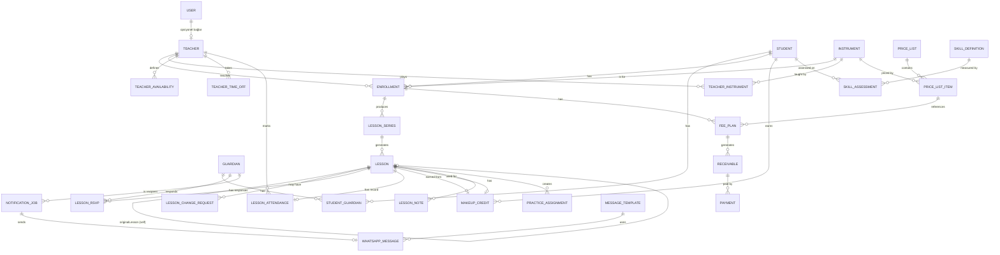

# Varlık İlişki Modeli

Mermaid ERD ve önemli kısıtlar. Tam kolon listesi için her modülün altındaki tablo tanımına bak; burada sadece ilişkiler ve iş açısından kritik alanlar var.

## Diyagram



## Auth

```
users
  id                uuid pk
  email             text unique          -- öğretmen için opsiyonel (telefon/kullanıcı adıyla da girilebilir)
  password_hash     text
  role              text                 -- ADMIN | TEACHER
  must_change_password boolean default false   -- B4: yönetici geçici şifre atadıysa true
  is_active         boolean default true
  created_at        timestamptz
  updated_at        timestamptz

audit_log
  id                uuid pk
  actor_user_id     uuid fk -> users(id) null   -- sistem tetiklediyse null
  action            text                 -- örn. "receivable.payment_recorded"
  entity_type       text
  entity_id         uuid
  before_json       jsonb null
  after_json        jsonb null
  created_at        timestamptz
```

## People

```
students
  id            uuid pk
  first_name    text
  last_name     text
  birth_date    date
  status        text        -- ACTIVE | INACTIVE
  created_at    timestamptz
  updated_at    timestamptz

guardians
  id                       uuid pk
  first_name               text
  last_name                text
  phone_number             text unique   -- E.164 normalize edilmiş
  whatsapp_enabled         boolean default true
  notification_consent     boolean default true
  consent_updated_at       timestamptz
  conversation_window_expires_at  timestamptz null   -- A7: son gelen mesaj + 24s
  created_at               timestamptz
  updated_at               timestamptz

student_guardians
  student_id     uuid fk -> students(id)
  guardian_id    uuid fk -> guardians(id)
  relationship   text null              -- anne, baba, vasi...
  is_primary     boolean default false
  PRIMARY KEY (student_id, guardian_id)

teachers
  id           uuid pk
  user_id      uuid fk -> users(id) unique null
  first_name   text
  last_name    text
  status       text        -- ACTIVE | INACTIVE
  created_at   timestamptz
  updated_at   timestamptz

instruments
  id       uuid pk
  name     text unique     -- Piyano, Gitar, Keman, Bateri
  code     text unique     -- PIANO, GUITAR, VIOLIN, DRUMS

teacher_instruments
  teacher_id     uuid fk -> teachers(id)
  instrument_id  uuid fk -> instruments(id)
  PRIMARY KEY (teacher_id, instrument_id)

enrollments
  id             uuid pk
  student_id     uuid fk -> students(id)
  teacher_id     uuid fk -> teachers(id)
  instrument_id  uuid fk -> instruments(id)
  status         text        -- ACTIVE | PAUSED | ENDED
  started_at     date
  ended_at       date null
  created_at     timestamptz
  updated_at     timestamptz
```

## Scheduling

```
lesson_series
  id                  uuid pk
  enrollment_id       uuid fk -> enrollments(id)
  day_of_week         smallint       -- 0=Pazartesi..6=Pazar
  start_time          time
  duration_minutes    smallint
  effective_from      date
  effective_until     date null
  status              text           -- ACTIVE | ENDED
  created_at          timestamptz
  updated_at          timestamptz

lessons
  id                  uuid pk
  lesson_series_id    uuid fk -> lesson_series(id) null   -- MAKEUP dersler seriye bağlı olmayabilir
  student_id          uuid fk -> students(id)
  teacher_id          uuid fk -> teachers(id)
  instrument_id       uuid fk -> instruments(id)
  start_at            timestamptz
  end_at              timestamptz
  status              text           -- NORMAL|RESCHEDULED|CANCELLED|COMPLETED|MAKEUP
  original_lesson_id  uuid fk -> lessons(id) null
  created_at          timestamptz
  updated_at          timestamptz

  UNIQUE (lesson_series_id, start_at)          -- mükerrer üretim engeli
  CHECK (end_at > start_at)

lesson_change_requests
  id                  uuid pk
  lesson_id           uuid fk -> lessons(id)
  requested_by        uuid fk -> users(id)
  reason              text null
  proposed_start_at   timestamptz
  proposed_end_at     timestamptz
  status              text     -- PENDING|APPROVED|REJECTED|ALTERNATIVE_PROPOSED|
                                -- PARENT_CONFIRMATION_PENDING|PARENT_ACCEPTED|PARENT_REJECTED
  created_at          timestamptz
  resolved_at         timestamptz null

teacher_availability
  id             uuid pk
  teacher_id     uuid fk -> teachers(id)
  day_of_week    smallint
  start_time     time
  end_time       time
  CHECK (end_time > start_time)

teacher_time_off                       -- A3
  id             uuid pk
  teacher_id     uuid fk -> teachers(id)
  starts_on      date
  ends_on        date
  reason         text null
  created_at     timestamptz

  CHECK (ends_on >= starts_on)

school_calendar_days                   -- A3, resital vb. de burada (C5)
  id             uuid pk
  date           date unique
  type           text        -- HOLIDAY | EVENT
  label          text        -- "Cumhuriyet Bayramı", "Yıl Sonu Resitali"
```

## Attendance

```
lesson_rsvps
  id             uuid pk
  lesson_id      uuid fk -> lessons(id)
  guardian_id    uuid fk -> guardians(id)
  response       text        -- UNKNOWN | ATTENDING | NOT_ATTENDING
  responded_at   timestamptz null
  source         text        -- WHATSAPP | ADMIN
  created_at     timestamptz

  UNIQUE (lesson_id, guardian_id)

lesson_attendances
  id                    uuid pk
  lesson_id             uuid fk -> lessons(id) unique
  status                text        -- PRESENT | ABSENT | EXCUSED
  marked_by_teacher_id  uuid fk -> teachers(id)
  marked_at             timestamptz
  note                  text null
```

## Pricing (yeni — A1)

```
price_lists
  id             uuid pk
  name           text                -- "2026-2027 Sezonu Fiyatları"
  effective_from date
  effective_until date null
  created_at     timestamptz
  created_by     uuid fk -> users(id)

price_list_items
  id                 uuid pk
  price_list_id      uuid fk -> price_lists(id)
  instrument_id      uuid fk -> instruments(id)
  duration_minutes   smallint            -- 30, 45, 60 dk gibi standart süreler
  billing_type       text                -- MONTHLY | PACKAGE
  amount             numeric(12,2)
  currency           text default 'TRY'
  package_lesson_count smallint null     -- billing_type=PACKAGE ise dolu

  CHECK (amount >= 0)
  -- Aynı (instrument_id, duration_minutes, billing_type) için çakışan tarih aralığı
  -- olamaz; genel aralık tipi yerine uygulama katmanında (Features/) kontrol edilir.
```

## Billing

```
fee_plans
  id                     uuid pk
  enrollment_id          uuid fk -> enrollments(id)
  price_list_item_id     uuid fk -> price_list_items(id)   -- A1: snapshot kaynağı
  billing_type           text        -- MONTHLY | PACKAGE (price_list_item ile tutarlı)
  amount                 numeric(12,2)   -- oluşturulduğu andaki fiyat, kopya
  currency               text default 'TRY'
  due_day                smallint null       -- MONTHLY: ayın kaçında
  package_lesson_count   smallint null       -- PACKAGE
  active_from            date
  active_until           date null
  created_at             timestamptz

receivables
  id             uuid pk
  enrollment_id  uuid fk -> enrollments(id)
  fee_plan_id    uuid fk -> fee_plans(id)
  price_list_item_id  uuid fk -> price_list_items(id)   -- A1: tutar burada da donmuş halde
  period         text          -- "2026-09" gibi dönem etiketi
  amount         numeric(12,2) -- fee_plan'dan kopyalanır, sonraki zamdan etkilenmez
  currency       text default 'TRY'
  due_date       date
  status         text          -- UNPAID | PARTIAL | PAID | OVERDUE | CANCELLED
  created_at     timestamptz
  updated_at     timestamptz

  UNIQUE (enrollment_id, period)
  CHECK (amount >= 0)

payments
  id             uuid pk
  receivable_id  uuid fk -> receivables(id)
  amount         numeric(12,2)
  payment_date   date
  method         text        -- CASH | TRANSFER | CARD | OTHER
  reference      text null
  note           text null
  created_by     uuid fk -> users(id)
  created_at     timestamptz

  CHECK (amount > 0)

makeup_credits                          -- A2
  id                    uuid pk
  student_id            uuid fk -> students(id)
  source_lesson_id      uuid fk -> lessons(id)     -- ≥24s önce iptal edilen ders
  earned_reason         text          -- GUARDIAN_CANCELLED_24H | SCHOOL_CANCELLED
  earned_at             timestamptz
  expires_at            timestamptz               -- earned_at + Policy__MakeupCreditValidDays
  used_lesson_id        uuid fk -> lessons(id) null
  used_at               timestamptz null
  status                text          -- AVAILABLE | USED | EXPIRED
```

## Progress

```
skill_definitions
  id              uuid pk
  code            text unique     -- RHYTHM, TEMPO_CONTROL, INTONATION, BOW_CONTROL...
  label           text            -- Türkçe gösterim adı
  instrument_id   uuid fk -> instruments(id) null   -- null ise ortak yetenek

lesson_notes
  id             uuid pk
  lesson_id      uuid fk -> lessons(id)
  teacher_id     uuid fk -> teachers(id)
  practiced      text null
  note           text null
  homework       text null
  next_goal      text null
  created_at     timestamptz

skill_assessments
  id                    uuid pk
  student_id            uuid fk -> students(id)
  skill_definition_id   uuid fk -> skill_definitions(id)
  lesson_id             uuid fk -> lessons(id) null
  score                 smallint     -- 1..5
  note                  text null
  assessed_at           timestamptz

  CHECK (score BETWEEN 1 AND 5)

practice_assignments
  id             uuid pk
  lesson_id      uuid fk -> lessons(id)
  description    text
  due_date       date null
  completed      boolean default false
```

## Messaging

```
notification_jobs
  id                     uuid pk
  type                   text     -- LESSON_REMINDER|LESSON_RESCHEDULED|MAKEUP_APPROVED|
                                   -- PAYMENT_REMINDER|BIRTHDAY|PACKAGE_ENDING
  recipient_phone_number text
  reference_type         text     -- "lesson" | "receivable" | "student"...
  reference_id           uuid
  scheduled_at           timestamptz
  status                 text     -- PENDING|PROCESSING|SENT|FAILED|CANCELLED
  attempt_count          smallint default 0
  last_error             text null
  sent_at                timestamptz null
  created_at             timestamptz
  updated_at             timestamptz

  UNIQUE (type, reference_type, reference_id)   -- A5: idempotency anahtarı

whatsapp_messages
  id                  uuid pk
  notification_job_id uuid fk -> notification_jobs(id) null
  guardian_id         uuid fk -> guardians(id)
  direction           text        -- OUTBOUND | INBOUND
  template_id         uuid fk -> message_templates(id) null
  body_snapshot       text        -- gönderilen/alınan gerçek metin
  provider_message_id text null
  sent_at             timestamptz null
  created_at          timestamptz

whatsapp_webhook_events
  id                  uuid pk
  provider_event_id   text unique
  event_type          text
  payload_json        jsonb
  received_at         timestamptz
  processed_at        timestamptz null
  status               text        -- RECEIVED|PROCESSED|FAILED
  processing_error     text null

message_templates
  id             uuid pk
  name           text unique     -- "lesson_reminder_rsvp"
  language       text default 'tr'
  body           text            -- Meta'ya onaylatılan gövde, placeholder'larla
  is_active      boolean default true
```

## Kritik kısıtlar — özet

```
UNIQUE (lesson_series_id, start_at)
UNIQUE (type, reference_type, reference_id) ON notification_jobs
UNIQUE (provider_event_id) ON whatsapp_webhook_events
UNIQUE (enrollment_id, period) ON receivables
UNIQUE (lesson_id, guardian_id) ON lesson_rsvps
UNIQUE (lesson_id) ON lesson_attendances
CHECK (end_at > start_at) ON lessons
CHECK (amount >= 0) ON receivables, price_list_items
CHECK (amount > 0) ON payments
CHECK (score BETWEEN 1 AND 5) ON skill_assessments
```
