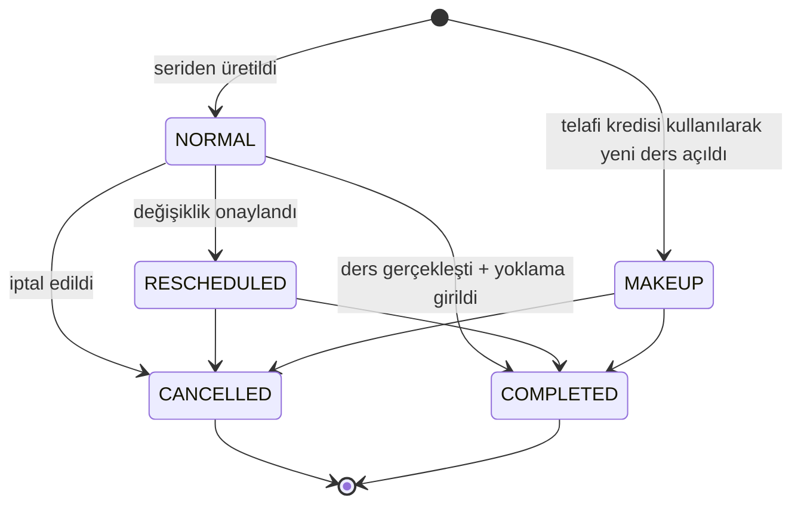
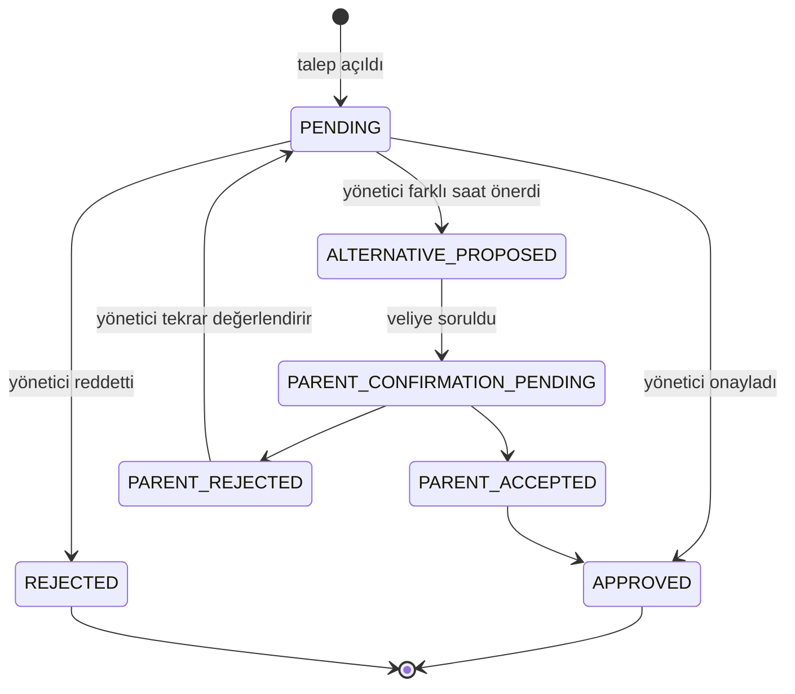
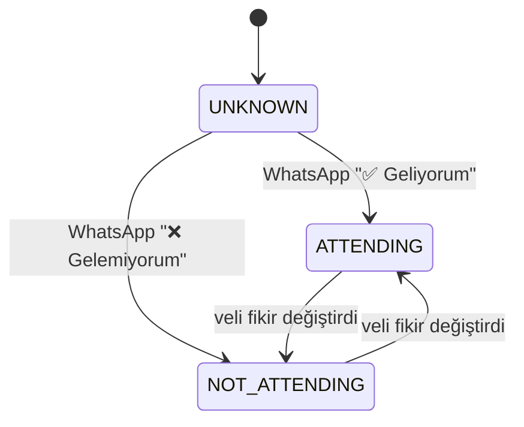
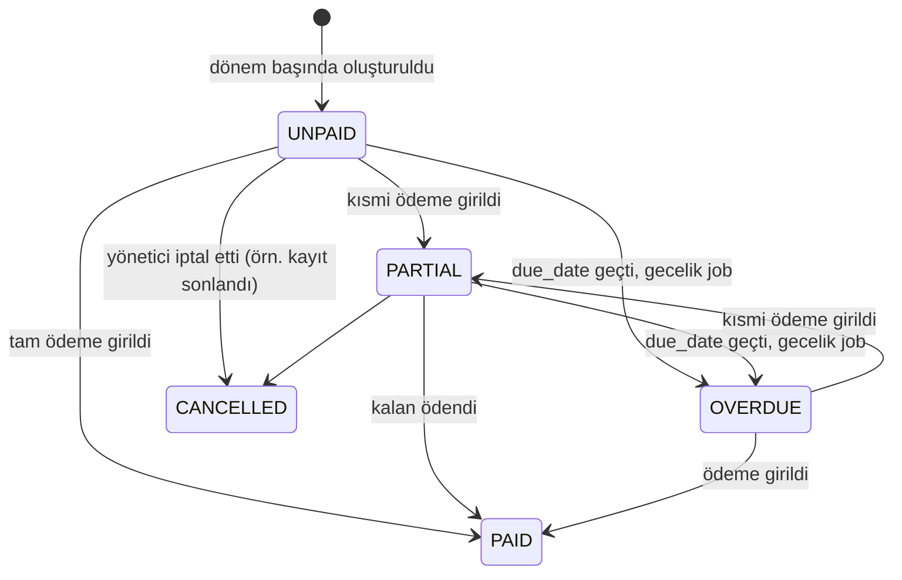
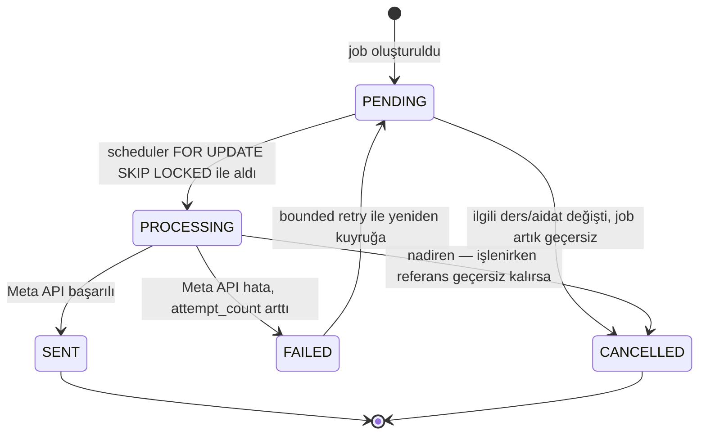
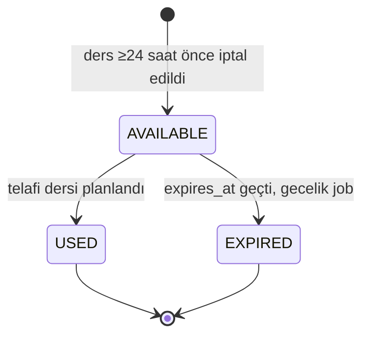

# Durum Makineleri

## Lesson

Kurallar:
- `RESCHEDULED`/`CANCELLED`'a geçişte `original_lesson_id` korunur; geçmiş asla üzerine yazılmaz, yeni satır açılır (audit-friendly history — master prompt gereksinimi).
- Bu geçişte bekleyen `LESSON_REMINDER` job'ı **iptal edilir** ve gerekiyorsa yeni saate göre yenisi kurulur (`CLAUDE.md` — "ders değişince eski job iptali").
- `COMPLETED`'a yalnızca `LessonAttendance` kaydı girildiğinde geçilir; ders saati geçti diye otomatik `COMPLETED` olmaz (öğretmen unutmuş olabilir, dashboard bunu "dikkat" listesine düşürür).
- `MAKEUP` statüsündeki ders bir `MakeupCredit.used_lesson_id` ile ilişkilendirilir.

## LessonChangeRequest

Kural: `PARENT_REJECTED` durumunda sistem **sessizce** takvimi tekrar değiştirmez — talep `PENDING`'e döner ve yönetici ekranında "dikkat" olarak görünür (master prompt gereksinimi, `docs/00-master-prompt.md` "Lesson change" akışı).

**Bilinçli eksik (denetim ARC-2, `docs/13-audit-fix-prompt.md`):** `ALTERNATIVE_PROPOSED`, `PARENT_CONFIRMATION_PENDING`, `PARENT_ACCEPTED`, `PARENT_REJECTED` yukarıdaki diyagramda tasarlanmış durumlardır ama bugün hiçbir use-case tarafından üretilmiyorlar (`LessonChangeRequestStatus` enum'unda tanımlı, kodda hiçbir yerde set edilmiyor) - bugünkü akış yalnızca `PENDING -> APPROVED/REJECTED`'i uyguluyor. Veliye alternatif saat önerme akışı Faz 7'ye kaldı; bu dört durum için ayrı bir kod değişikliği gerekmiyor, yalnızca gerçekten uygulanana kadar üretilmemeleri bilinçli.

## LessonRsvp.response

`ATTENDING`/`NOT_ATTENDING` velinin **niyetini** ifade eder, gerçek yoklamayı değil — bu ikisi asla birleştirilmez (master prompt'un açık kuralı).

## LessonAttendance.status

Tek yönlü kayıt, geçiş yok: öğretmen dersten sonra `PRESENT | ABSENT | EXCUSED` seçer, `lesson_id` üzerinde `UNIQUE` olduğu için bir kez girilir. Düzeltme gerekirse mevcut kayıt güncellenir ve `audit_log`'a düşer (kim, ne zaman, eski/yeni değer) — silinmez.

## Receivable.status

`OVERDUE` türetilmiş bir görünüm değil, **saklanan** bir statüdür — gecelik bir job `due_date < today AND status IN (UNPAID, PARTIAL)` olan kayıtları `OVERDUE`'ya çevirir (bkz. `docs/10-decisions.md` B3). Bu, dashboard sorgusunun her istekte tarih hesaplamak yerine indexlenmiş bir kolon okumasını sağlar.

## NotificationJob.status

`FAILED → PENDING` geçişi `attempt_count < Notifications__MaxAttempts` olduğu sürece otomatik; limit aşılınca job `FAILED` kalır ve yönetici panelinde "yeniden dene" ile elle tetiklenir (master prompt — "failed jobs must remain visible").

## MakeupCredit.status

Kredi doğuran tek olay: dersin `CANCELLED` olma anı ile `start_at` arasında ≥`Policy__MakeupNoticeHours` (varsayılan 24) saat olması. Habersiz gelmeme (`ABSENT`) kredi doğurmaz.
