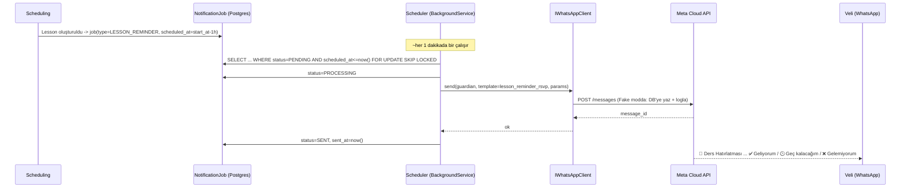
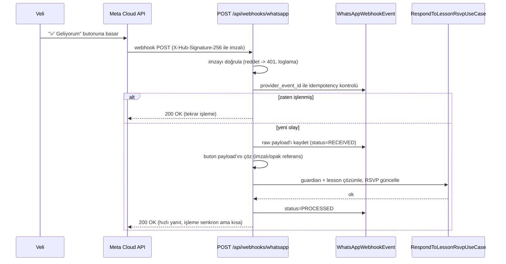

# WhatsApp Mesajlaşma

Meta WhatsApp Business Cloud API. Sağlayıcı mantığı `Messaging` modülüne izole edilir; `Scheduling`/`Billing` doğrudan Meta API çağırmaz — `INotificationScheduler` benzeri bir port üzerinden `NotificationJob` oluşturur.

## Ders hatırlatması — uçtan uca akış



## Gelen RSVP — webhook akışı



Kural: webhook her koşulda hızlı `2xx` döner; uzun süren işlem varsa (yok bu ölçekte) arka plana atılır ama şu an senkron işleme yeterli çünkü tüm adımlar milisaniyeler sürer.

## Template

```
Ad: lesson_reminder_rsvp
Dil: tr

🎹 Ders Hatırlatması

Merhaba {{guardian_name}},

{{student_name}} öğrencimizin {{instrument}} dersi bugün
{{lesson_time}} saatinde.

Öğretmen: {{teacher_name}}

Katılım durumunuzu bildirir misiniz?

Hızlı yanıtlar (quick-reply buton, index 0/1/2):
0: ✅ Geliyorum
1: 🕒 Geç kalacağım
2: ❌ Gelemiyorum
```

Meta kısıtı: quick-reply buton metni ≤20 karakter, en fazla 3 buton — üçü de sınırın altında
("Geç kalacağım" 14 karakter). Üçüncü buton admin panelden (Mesaj Merkezi > Şablonlar ve
otomasyon) kapatılabilir (`NotificationAutomationSettings.AllowAttendingLateResponse`) - kapalıyken
yalnızca ilk iki buton (index 0/1) gönderilir, üçüncüsü şablonun kendisinde tanımlı kalsa bile
payload override edilmediği için tıklanırsa imza doğrulaması zaten geçersiz olur.

## Buton payload güvenliği

Payload'da tahmin edilebilir dahili id kullanılmaz (`lesson_id=42` gibi). Bunun yerine imzalı/opak referans:

```
rsvp_attending:e0b5c3a9f2...        (Evet)
rsvp_attending_late:e0b5c3a9f2...   (Geç kalacağım - Faz 3)
rsvp_not_attending:e0b5c3a9f2...    (Hayır)
```

(hepsi HMAC ile `WhatsApp__PayloadSigningKey` kullanılarak imzalanmış)

Bu payload'lar Meta'nın onaylı şablonundaki **sabit** buton metninin (görünen "Geliyorum" vb.)
altına, gönderim anında `components: [{type: "button", sub_type: "quick_reply", index, parameters:
[{type: "payload", payload: "..."}]}]` ile per-ders override edilir (`CloudApiWhatsAppClient.
SendTemplateAsync`, `NotificationMessageBuilder.BuildLessonMessageAsync`) - böylece her ders için
farklı, tahmin edilemez bir payload gider ama buton metni şablon onayında sabitlenen hâliyle kalır.

Sunucu, gelen payload'ı doğrulamadan hiçbir lesson/guardian eşlemesi yapmaz — imza tutmuyorsa istek `422` ile reddedilir ve olay `FAILED` olarak loglanır.

**Boş anahtar fail-closed'dır (denetim SEC-1/SEC-2, bkz. `docs/13-audit-fix-prompt.md`):** `WhatsApp__AppSecret` ve `WhatsApp__PayloadSigningKey` boş/tanımsızsa `WebhookSignatureVerifier.IsValid` ve `RsvpButtonPayload.TryVerify` doğrudan `false` döner — boş anahtarla HMAC hesaplayıp deterministik/tahmin edilebilir bir sonuçla karşılaştırmaz. Ayrıca `Program.cs`'teki `ProductionSecretsGuard`, `Production` ortamında bu iki değişken tanımsızsa uygulamanın başlamasını tamamen engeller. `WhatsApp__Provider=Cloud` seçildiyse `WhatsApp__PhoneNumberId`, `WhatsApp__AccessToken` ve `WhatsApp__WebhookVerifyToken` da başlangıçta zorunlu doğrulanır; eksik Cloud ayarıyla uygulama yanıltıcı biçimde sağlıklı görünmez. Development'ta bu guard zorunlu değildir; `Fake` sağlayıcı Meta kimlik bilgilerini kullanmaz.

## Konuşma penceresi (24 saat) — A7

`Guardian.conversation_window_expires_at` her **gelen** mesajda `now() + 24h` olarak güncellenir. Deterministik intent'lere (`ders`, `aidat`, `telafi`, `okula yaz`) serbest metinle cevap verilirken:

- Pencere açıksa: serbest metin cevabı gönderilir.
- Pencere kapalıysa: onaylı bir template kullanılır ya da (template yoksa) gönderim atlanır ve olay yönetici panelinde görünür hâle gelir. Serbest metin asla pencere dışında gönderilmez.

## Sessiz saat — A6

`Notifications__QuietHoursStart/End` (varsayılan 21:00–09:00, `Europe/Istanbul`) yalnızca **zamanlanmış** (cron kaynaklı) job tiplerine uygulanır: `PAYMENT_REMINDER`, `BIRTHDAY`, `PACKAGE_ENDING`. `LESSON_REMINDER` dersten 1 saat önce gittiği için ders saatleri zaten okul saatleri içinde olduğundan bu kurala tabi değildir.

Pencere dışında `scheduled_at`'i gelen bir job, worker tarafından gönderilmeden önce kontrol edilir; pencere kapalıysa `scheduled_at` bir sonraki pencere başlangıcına ötelenir (job `PENDING` kalır, `sent_at` boş kalır).

## Opt-out — A8

Gelen mesaj metninde `dur` / `iptal` / `stop` (case-insensitive) geçiyorsa:
1. `Guardian.notification_consent = false`, `consent_updated_at = now()` (audit_log'a yazılır — rıza değişimi hassas işlemdir).
2. O veliye ait bekleyen (`PENDING`) tüm `notification_jobs` → `CANCELLED`.
3. Tek bir teyit mesajı gönderilir: *"Bildirimleriniz durduruldu. Tekrar açmak isterseniz bize yazabilirsiniz."*
4. Sonraki hiçbir job bu veli için oluşturulmaz — job oluşturma use-case'i her zaman `notification_consent` kontrolüyle başlar.

## No-response politikası

Ders başına tek hatırlatma (dersten 1 saat önce). İkinci hatırlatma (örn. 15 dk önce) MVP'de **yok** — ileride açılabilecek bir ayar olarak bırakılır, şimdiden kod yazılmaz (master prompt + over-engineering kaçınma). Cevapsız kalan RSVP dashboard'da "Cevap yok" (`noResponse`) olarak sayılır.

## Idempotency özeti

| Katman | Anahtar |
|---|---|
| `notification_jobs` oluşturma | `UNIQUE (type, reference_type, reference_id)` — aynı ders için ikinci hatırlatma job'ı DB seviyesinde engellenir |
| Webhook olay işleme | `UNIQUE (provider_event_id)` — Meta aynı olayı tekrar gönderse de tek kayıt |
| Job işleme (worker eşzamanlılığı) | `FOR UPDATE SKIP LOCKED` — iki worker aynı job'ı asla iki kez işlemez |

## Geliştirme ortamı — Meta hesabı olmadan (D2)

`WhatsApp__Provider=Fake` (dev varsayılanı):
- `FakeWhatsAppClient` gönderilecek mesajı `whatsapp_messages` tablosuna yazar ve Serilog'a basar, gerçek bir API çağrısı yapmaz.
- Dev-only bir uç nokta (`POST /api/dev/whatsapp/simulate-webhook`, yalnızca `ASPNETCORE_ENVIRONMENT=Development`'ta açık) gerçek bir Meta webhook payload'ının aynısını üretip `POST /api/webhooks/whatsapp`'a yönlendirir — RSVP akışı uçtan uca, Meta hesabı olmadan test edilebilir.

Bu sayede Phase 5'in kod kısmı, Meta işletme doğrulaması ve template onayı (günler–haftalar sürebilir) beklenmeden ilerleyebilir. WABA başvurusu ve template onayı ayrı, paralel bir iş kalemi olarak bugün başlatılmalı.
