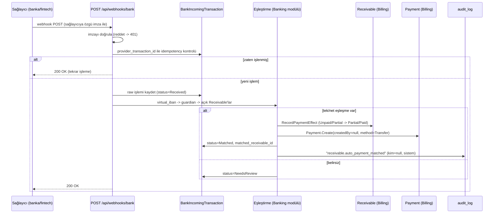
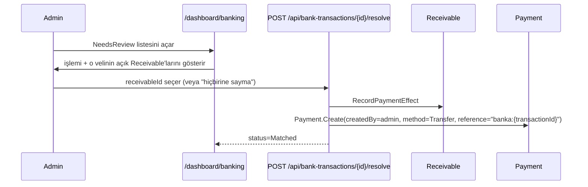

# Banka Entegrasyonu — Sanal IBAN (Faz 6)

`docs/10-decisions.md` E1: master prompt'un başlangıçta hariç tuttuğu bir kapsam, kullanıcının açık onayıyla eklendi. Kapsam yalnızca **gelen havale/EFT'nin `Receivable`'a otomatik işlenmesi** — online ödeme/checkout, e-fatura, muhasebe entegrasyonu kapsam dışı kalmaya devam ediyor.

Sağlayıcı mantığı `Banking` modülüne izole edilir; `Billing` doğrudan bir bankanın/fintech'in API'sini çağırmaz — `IBankPaymentProvider` portu üzerinden sanal IBAN atanır ve gelen işlem bildirimleri işlenir (WhatsApp'taki `IWhatsAppClient`/D2 deseninin birebir aynısı).

## Neden isim eşleştirme değil

Gönderen adı tek başına güvenilmez: veli farklı bir hesaptan gönderebilir (eşinin, kendi şirketinin), aynı isimde birden fazla veli olabilir, ad/soyad yazımı değişebilir. Sanal IBAN bu belirsizliği baştan ortadan kaldırıyor — **hangi veli** sorusu IBAN ile kesin cevaplanıyor, geriye yalnızca **hangi Receivable** sorusu kalıyor.

## Veli ↔ Receivable eşleştirme algoritması

Bir veliye atanmış sanal IBAN'a bir transfer geldiğinde:

1. `VirtualIban.GuardianId` ile veli kesin olarak bilinir.
2. O velinin `StudentGuardian` üzerinden bağlı olduğu öğrencilerin, `Enrollment` üzerinden açık (`Unpaid`/`Partial`/`Overdue`) `Receivable`'ları toplanır.
3. Gelen işlemin `description` alanı bir dönem deseniyle (`YYYY-MM`) eşleşen bir `Receivable.Period` içeriyorsa ve tutar o `Receivable`'ın kalan bakiyesine eşit veya fazlaysa → **doğrudan o `Receivable`'a uygulanır**.
4. Açıklama eşleşmesi yoksa: tutar, açık `Receivable`'lardan **tam olarak birinin** kalan bakiyesine eşitse → o `Receivable`'a uygulanır.
5. Yukarıdakilerin hiçbiri tek bir aday üretmiyorsa (birden fazla eşleşme, hiç eşleşme, veya hiç açık `Receivable` yok) → işlem **otomatik uygulanmaz**, `NeedsReview` durumunda kalır. Admin panelinde görünür, admin elle hangi `Receivable`'a sayılacağını seçer (ya da hiçbirine saymayıp `Ignored` işaretler — örn. bağış, yanlış hesap).

Belirsizlikte otomatik davranmamak bilinçli bir tercih — WhatsApp opt-out/RSVP akışlarındaki "belirsizse insana bırak" ilkesiyle tutarlı, para söz konusu olduğunda daha da kritik.

## Uçtan uca akış — otomatik eşleşen işlem

## Belirsiz işlemin elle çözülmesi

## Sanal IBAN ataması

Admin bir veliye sanal IBAN atar: `POST /api/guardians/{id}/virtual-iban`. `IBankPaymentProvider.AllocateVirtualIbanAsync(guardianId)` çağrılır, dönen IBAN + sağlayıcı referansı `VirtualIban` olarak saklanır. Bir veliye birden fazla aktif sanal IBAN atanamaz (`UNIQUE(guardian_id) WHERE status='Active'` — uygulama katmanında kontrol edilir, bkz. `price_list_items` çakışma kontrolü örneği).

## Idempotency özeti

| Katman | Anahtar |
|---|---|
| Gelen işlem kaydı | `UNIQUE (provider, provider_transaction_id)` — sağlayıcı aynı bildirimi tekrar gönderse de tek kayıt |
| Aynı işlemin iki kez `Payment`'a dönüşmesi | `BankIncomingTransaction.Status` bir kez `Matched`'e geçer, tekrar işlenemez (durum makinesi guard'ı) |

## Geliştirme ortamı — gerçek sağlayıcı hesabı olmadan (E1/D2 deseni)

`Banking__Provider=Fake` (dev varsayılanı):
- `FakeBankPaymentProvider`, `AllocateVirtualIbanAsync` çağrıldığında sahte ama gerçekçi görünen bir IBAN üretir (`TR` + rastgele haneler), gerçek bir API çağrısı yapmaz.
- Dev-only uç nokta (`POST /api/dev/bank/simulate-transaction`, yalnızca `ASPNETCORE_ENVIRONMENT=Development`) gerçek bir sağlayıcı webhook'unun taşıyacağı alanları (virtual_iban, amount, senderName, description, provider_transaction_id) alıp doğrudan işleme fonksiyonunu çağırır — eşleştirme mantığı gerçek sağlayıcı seçilmeden önce uçtan uca test edilebilir.

Gerçek sağlayıcı (PayTR/Papara İşletme/banka Sanal IBAN ürünü) seçildiğinde yalnızca yeni bir `IBankPaymentProvider` implementasyonu + webhook imza doğrulama şeması eklenir; `Banking` modülünün geri kalanı (eşleştirme, `Payment` oluşturma, admin çözümleme ekranı) değişmez.

## `Payment.CreatedBy` nullable oldu

Otomatik eşleşen ödemelerde bir admin yok. `AuditLog.ActorUserId` zaten nullable ve sistem-kaynaklı olayları (`guardian.opted_out` gibi) `null` ile işaretliyor — `Payment.CreatedBy` aynı kurala uyumlu hale getirildi (migration: kolonu nullable'a çeviren additive bir değişiklik, veri kaybı riski yok).

## `Banking__Provider` modları

| Değer | Ne yapar | Nerede kullanılır |
|---|---|---|
| `Fake` | Sahte ama gerçekçi görünen bir TR IBAN üretir. `POST /api/dev/bank/simulate-transaction` ile eşleştirme mantığı test edilir. | **Yalnızca Development/test.** `ProductionSecretsGuard` production'da reddeder. |
| `Manual` | Sanal IBAN tahsisini açık bir hata mesajıyla reddeder. Otomatik havale eşleştirme kapalıdır; admin ödemeyi elle girer. | **Production'da geçerli.** Gerçek sağlayıcı seçilene kadar okulun canlıya çıkmasını bloke etmez. |
| *(gerçek sağlayıcı)* | Henüz seçilmedi. | — |

Neden `Fake` production'da yasak: ürettiği IBAN gerçekçi görünür ama sahtedir. Bir veliye
verilirse para hiçbir yere gitmez ve bu sessizce fark edilmeden sürebilir. `Manual` bunun
yerine **görünür ret** üretir — sessiz başarısızlık yerine açık hata.

Geçerli değerler tek bir yerde, `Modules/Banking/Domain/BankingProviderModes.cs` içinde
tanımlıdır. Bunun nedeni gerçek bir hata: `ProductionSecretsGuard` "`Fake` olmasın" derken
`Program.cs` "`Fake` dışında her şeye `throw`" ediyordu — yani Production'da hiçbir değer
çalışmıyor, uygulama hiç ayağa kalkamıyordu. Guard'ı izole test eden birim testi bunu
göremiyordu; artık `BankingProviderModesTests` iki taraf arasındaki tutarlılığı bekçiliyor.

Gerçek sağlayıcı seçildiğinde: yeni bir `IBankPaymentProvider` implementasyonu eklenir,
`BankingProviderModes`'a tek satır girer ve `Webhooks.cs`'deki `VerifySharedSecret` o
sağlayıcının gerçek imza şemasıyla değiştirilir. Eşleştirme, admin çözümleme ve testler
değişmez.
