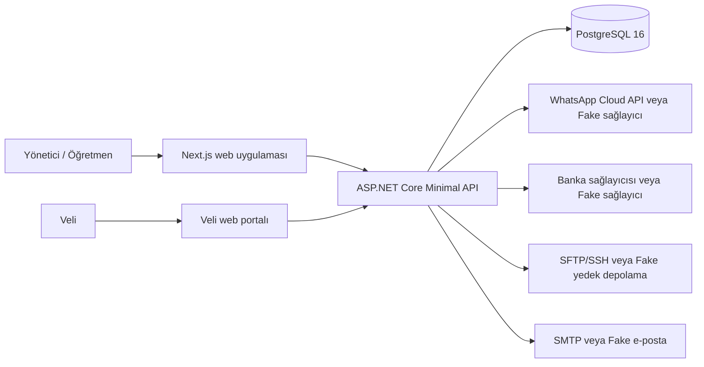
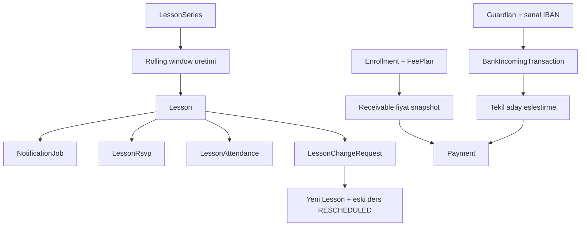

# Abdera — Teknik Mimari

Bu belge, repodaki mevcut uygulama mimarisini ve doğrulama durumunu özetler. Kaynak kod ve mevcut iş kurallarıyla çelişen hedef mimari önerileri içermez.

## 1. Sistem bağlamı



Kapsam, küçük bir müzik okulunun yönetim işlemlerini tek uygulamada toplar: kişiler, ders takvimi, RSVP/yoklama, aidat ve ödemeler, WhatsApp bildirimleri, sanal IBAN eşleştirmesi, yedekleme ve sistem sağlığı.

## 2. Çalışma zamanı bileşenleri

| Bileşen | Teknoloji | Sorumluluk |
|---|---|---|
| `web` | Next.js 16 App Router, React 19, TypeScript, Tailwind 4 | Admin/teacher dashboard ve veli portalı; ekran durumu TanStack Query ile yönetilir. |
| `api` | .NET 10, ASP.NET Core Minimal API | Kimlik, yetkilendirme, use-case endpoint’leri, arka plan işleri ve entegrasyon koordinasyonu. |
| `db` | PostgreSQL 16 | Tek kalıcı veri deposu; EF Core migration’larıyla şema yönetilir. |
| Bildirim işçisi | `BackgroundService` + `PeriodicTimer` | Bekleyen bildirimleri `FOR UPDATE SKIP LOCKED` ile alır; idempotency ve retry uygular. |
| Yedekleme işçisi | `BackgroundService` | `pg_dump` çıktısını AES-256-GCM ile şifreleyip Fake/SFTP depoya gönderir. |
| Sağlık işçisi | `BackgroundService` | PostgreSQL ve yedekleme tazeliğini değerlendirir; gerekirse SMTP/Fake alarm üretir. |

Docker Compose, `db` → `api` → `web` bağımlılık sırasını ve healthcheck tabanlı başlangıcı yönetir. API container’ı root olmayan `app` kullanıcısıyla çalışır; Data Protection anahtarları volume’da tutulur.

## 3. Backend modül yapısı

Backend, katman başına global klasörler yerine modül başına dikey dilim kullanır:

```text
backend/src/Abdera.Api/
├── Modules/
│   ├── Auth/       # cookie oturumu, OTP, parola, audit
│   ├── People/     # öğrenci, veli, öğretmen, kayıt, veli portalı
│   ├── Scheduling/ # seri ders, takvim, değişiklik, tatil/izin
│   ├── Attendance/ # RSVP, yoklama, telafi tetikleri
│   ├── Progress/   # ders notları
│   ├── Pricing/    # fiyat listesi ve toplu fiyat güncelleme
│   ├── Billing/    # aidat, ödeme, gider, telafi kredisi
│   ├── Messaging/  # template, webhook, bildirim kuyruğu
│   ├── Banking/    # sanal IBAN, gelen işlem, eşleştirme
│   ├── Ops/        # yedekleme ve sistem sağlığı
│   └── Dashboard/  # rol kapsamlı özet sorguları
└── Shared/
    ├── AbderaDbContext.cs
    ├── AuthContext.cs / AuthorizationPolicies.cs
    ├── GlobalExceptionHandler.cs
    ├── DatabaseMigrator.cs
    └── ortak saat, JSON, telefon ve bootstrap yardımcıları
```

Her modül `Domain`, `Features` ve gerekiyorsa `Persistence` klasörlerine ayrılır. Feature dosyası request/handler/endpoint kaydını birlikte taşır. Repository katmanı yoktur; tüm modüller tek `AbderaDbContext` kullanır.

## 4. Veri ve iş akışı



Kritik invariant’lar:

- Para `decimal(12,2)` ve currency ile saklanır; aidat oluşurken fiyat snapshot’ı alınır.
- Ders saati değişince eski bekleyen bildirim iptal edilir, yeni ders için yeni hatırlatma kurulabilir.
- 24 saat veya daha erken okul/veli iptal kuralları telafi kredisine dönüşür; no-show kredi doğurmaz.
- Banka eşleştirmesinde tek net aday yoksa işlem otomatik eşleşmez, `NeedsReview` kalır.
- Finansal/audit kayıtları silinmez; durum değişimi ve audit log kullanılır.
- Zaman veritabanında UTC `timestamptz`, okul görünümünde `Europe/Istanbul` olarak işlenir.

## 5. Kimlik ve güvenlik

- Yönetici/öğretmen: kendi `users` tablosu, `PasswordHasher<User>`, httpOnly cookie.
- Veli: `Guardian` tablosundaki telefon + OTP, ayrı `Guardian` password hasher ve Guardian-only cookie claim’i.
- Yetki politikaları tek yerde tanımlıdır: `AdminOnly`, `TeacherOrAdmin`, `GuardianOnly`.
- Cookie `Secure` politikası production’da zorunludur; CORS yalnızca frontend origin’i ve credential’larla sınırlıdır.
- Login ve OTP endpoint’leri IP başına rate limitlidir; webhook’larda imza ve idempotency kontrolü vardır.
- Production secret guard, zorunlu gizli ayarların eksik/varsayılan kalmasını engeller.
- Dev simülatörleri yalnızca `Development` ortamında route edilir.

## 6. Frontend veri akışı

`frontend/src/lib/api.ts` backend’e giden tek HTTP katmanıdır. Her istek credential cookie taşır; hatalar RFC 7807 gövdesinden `ApiError` olarak normalize edilir. Modül bazlı hook’lar TanStack Query cache’ini günceller ve mutation sonrası ilgili query’leri invalid eder.

Korumalı route davranışı:

1. `/dashboard/*` `GET /api/auth/me` ile oturumu kontrol eder.
2. Yetkisiz durumda `/login`’e yönlendirir.
3. `/parent/*` `GET /api/guardian/me` ile veli oturumunu kontrol eder.
4. Yetkisiz durumda `/parent/login`’e yönlendirir.

Admin dashboard ve veli portalı aynı Next.js uygulamasında olsa da API’de ayrı authorization policy ve ayrı veri sorguları kullanır; veli sorguları URL’deki öğrenci/lesson id’sine güvenmez.

## 7. Dağıtım ve konfigürasyon

- Local/CI: `docker compose up` (api + web + db) veya doğrudan .NET/Node komutları.
- **Production: `docker compose --profile prod up -d`** — ek olarak Caddy servisi ayağa kalkar.
- API image: .NET Alpine + `tzdata`, ICU, `pg_dump`, Kerberos runtime; `DOTNET_SYSTEM_GLOBALIZATION_INVARIANT=false`.
- Web image: Next.js standalone output ve Node 22 Alpine.
- Konfigürasyon ortam değişkenlerinden okunur; `ConnectionStrings:Default` ve cookie/CORS ayarları DI/configuration aşamasında çözülür.
- Migration’lar `Database:AutoMigrate=true` iken API başlangıcında uygulanır.
- Sağlık: `GET /health`; OpenAPI development ortamında [`/openapi/v1.json`](http://localhost:8080/openapi/v1.json).

### 7.1 TLS ve reverse proxy (`prod` profili)

Production'da oturum çerezleri `Secure=Always` ile işaretlenir — düz HTTP üzerinden tarayıcı
çerezi hiç göndermez ve **giriş sessizce çalışmaz**. TLS bu yüzden opsiyonel değildir.

- `Caddyfile` tek domain sunar: `/api/*` ve `/health` → `api:8080`, geri kalanı → `web:3000`.
  Aynı origin olduğu için CORS pratikte devre dışı kalır.
- Caddy Let's Encrypt sertifikasını kendisi alır/yeniler; `PUBLIC_DOMAIN` ve `ACME_EMAIL` gerekir.
- `api`/`web`/`db` port publish'leri `127.0.0.1`'e bağlıdır — dışarıdan tek giriş Caddy'dir.
- `Program.cs` `UseForwardedHeaders` ile `X-Forwarded-For`/`-Proto` okur. `KnownIPNetworks`
  ve `KnownProxies` temizlenir (Docker köprü ağı sabit adres vermez, aksi halde header'lar
  sessizce yok sayılırdı). Bu ancak API dışarıya kapalıyken güvenlidir — yukarıdaki
  `127.0.0.1` bağlaması bu güvenliğin ön koşuludur.
- Bu olmadan rate limiting tüm okulu tek IP kovasına koyardı: bir kişinin 5 hatalı girişi
  herkesi kilitlerdi.

### 7.2 Sağlayıcı modları

| Ayar | Development | Production |
|---|---|---|
| `WhatsApp__Provider` | `Fake` | `Cloud` (zorunlu) |
| `Banking__Provider` | `Fake` | `Manual` veya gerçek sağlayıcı — `Fake` reddedilir |
| `Backup__Provider` | `Fake` | `Sftp` (zorunlu) |
| `Email__Provider` | `Fake` | `Smtp` (opsiyonel; seçilirse kimlik bilgisi zorunlu) |
| `Ai__Provider` | `Disabled` | `Disabled` veya `OpenAi` — **opsiyonel** |

`ProductionSecretsGuard` bu tabloyu başlangıçta fail-fast doğrular. `Banking` için geçerli
değerler `BankingProviderModes` içinde tek yerde tanımlıdır; guard ve `Program.cs` aynı
kaynağı kullanır (ikisi ayrışınca uygulama Production'da hiç ayağa kalkamıyordu —
bkz. `docs/12-bank-integration.md`).

## 8. Test durumu ve boşluklar

Mevcut doğrulama (25 Ağustos 2026 itibarıyla gerçekten çalıştırıldı):

- **Backend:** xUnit + Testcontainers PostgreSQL — `319` test geçti, 0 başarısız, 0 uyarı.
- **Frontend:** ESLint temiz, production `next build` geçti.
- **Browser E2E:** Playwright, gerçek Compose uygulamasına karşı `4` senaryo geçti
  (admin / öğretmen / veli + veli veri izolasyonu). CI'da `e2e-smoke` job'ı olarak koşuyor.
- **Temiz veritabanı:** `docker compose down -v` sonrası 0 → latest 19 migration uygulandı,
  `/health` `Healthy`.
- **Seed idempotency:** demo seed iki kez çalıştırıldı, ikinci çağrı `already-seeded` döndü
  ve tüm satır sayıları değişmedi.
- **Production başlangıcı:** `ASPNETCORE_ENVIRONMENT=Production` ile konteyner gerçekten
  ayağa kalktı ve `/health` 200 döndü; `Banking__Provider=Fake`, bilinmeyen sağlayıcı ve
  eksik `WhatsApp__AppSecret` senaryolarının üçü de açık mesajla fail-fast reddedildi.

Kalan boşluklar:

- Frontend React hook/component unit testleri yok; `api.ts`, auth redirect'leri ve form hata
  durumları E2E üzerinden indirekt doğrulanıyor.
- Banka ve WhatsApp dev simülatörlerinin UI'dan başlatılan akışları backend entegrasyonuyla
  kapsanıyor, UI E2E olarak eksik.
- **Dış bağımlılık nedeniyle doğrulanamayanlar** (kod tarafı tamam ve testli, eksik olan
  yalnızca kimlik bilgisi): gerçek SFTP sunucusuna şifreli aktarım, gerçek Meta WhatsApp
  hesabı + template onayı, gerçek banka sağlayıcısı sandbox'ı.
- AI özelliği OpenAI uyumlu bir stub sunucuya karşı uçtan uca doğrulandı (istek/yanıt
  sözleşmesi, yetki sınırı, kalıcılaştırmama, audit); gerçek OpenAI anahtarıyla canlı çağrı
  yapılmadı.

## 9. İzlenmesi gereken teknik riskler

- `Database:AutoMigrate` production’da açık tutulursa deploy sırasında migration kilitlenmesi/geri dönüş prosedürü ayrıca işletilmelidir.
- Tek API instance ve in-process background worker ölçek büyüdüğünde bildirim/backup işlerinin liderlik ve dağıtık kilit ihtiyacı yeniden değerlendirilmelidir.
- OTP ve dev simülatörleri production config’de kapalı tutulmalı; gerçek sağlayıcı geçişi öncesi secret rotation ve webhook provider sözleşmesi doğrulanmalıdır.
- Gider, aidat ve banka ekranlarında sayfalama mevcut; benzer yeni listeler `Take` ile sessizce sınırlandırılmamalıdır.
